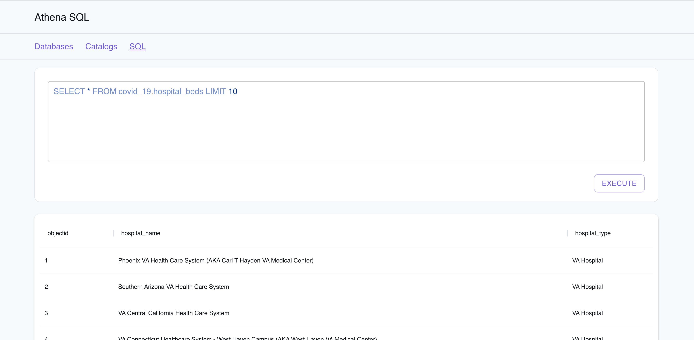
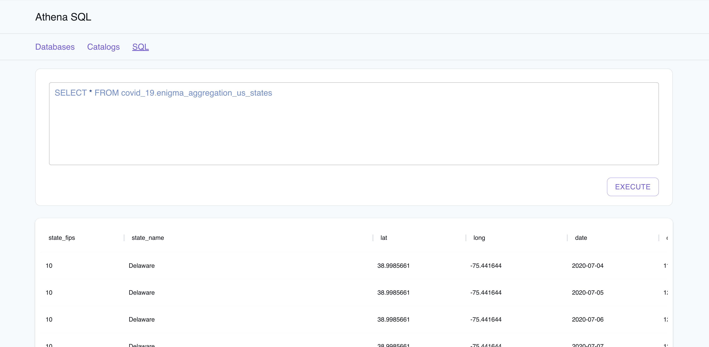
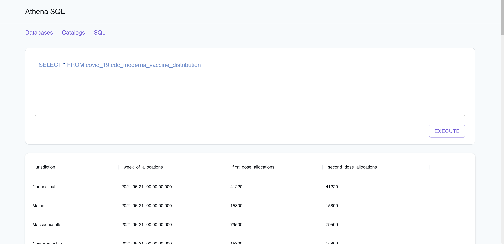

# Query data in S3 Bucket with Amazon Athena, Glue Catalog & CloudFormation

| Key          | Value                                                                                 |
| ------------ | ------------------------------------------------------------------------------------- |
| Environment  |                                                                       |
| Services     | Glue, Athena, S3, CloudFormation                    |
| Integrations | CloudFormation                                                    |
| Categories   | Big Data                            |
| Level        | Intermediate                                                                          |
| GitHub       | [Repository link](https://github.com/aws-samples/query-data-in-s3-with-amazon-athena-and-aws-sdk-for-dotnet) |

## Introduction

The Query data in S3 Bucket application sample demonstrates how you can leverage Amazon Athena to run standard SQL to analyze a large amount of data in Amazon S3 buckets. The application sample fetches COVID-19 data from the [Registry of Open Data on AWS](https://registry.opendata.aws/) and allows you to run Athena SQL queries using the [LocalStack Web Application](https://app.localstack.cloud) to list the results from Athena Database/Tables. Users can deploy this application setup via Glue Catalog on AWS & LocalStack using CloudFormation with no changes. To test this application sample, we will demonstrate how you use LocalStack to deploy the infrastructure on your developer machine and your CI environment and run queries against the deployed resources on LocalStack's [Athena Resource Browser](https://app.localstack.cloud/resources/athena/sql). 

## Architecture diagram

The following diagram shows the architecture that this sample application builds and deploys:


We are using the following AWS services and their features to build our infrastructure:

- [S3](https://docs.localstack.cloud/user-guide/aws/s3/) to store the datasets and the results of the Athena SQL queries.
- [Glue](https://docs.localstack.cloud/user-guide/aws/glue/) Data Catalog to set up the definitions for that data and create the database & tables.
- [Athena](https://docs.localstack.cloud/user-guide/aws/athena/) as a serverless interactive query service to query the data in the AWS COVID-19 data lake.
- [CloudFormation](https://docs.localstack.cloud/user-guide/aws/cloudformation/) as an Infrastructure-as-Code (IaC) framework to create our stack, which includes the `covid-19` database in our Data Catalog.

## Prerequisites

- LocalStack Pro with the [`localstack` CLI](https://docs.localstack.cloud/getting-started/installation/#localstack-cli).
- [AWS CLI](https://docs.localstack.cloud/user-guide/integrations/aws-cli/) with the [`awslocal` wrapper](https://docs.localstack.cloud/user-guide/integrations/aws-cli/#localstack-aws-cli-awslocal).

We are using Athena & Glue Data Catalog in our sample application. These services are available in a BigData Mono container which installs dependencies directly into the LocalStack (`localstack-main`) container. While launching these services for the first time, the BigData Mono container will download the required dependencies (Hadoop, Hive, Presto, etc.) and install them into the LocalStack container. This process may take a few minutes. 

To circumvent this, you can pull the `localstack/localstack-pro:2.0.0-bigdata` Mono container image with pre-installed default dependencies. You can launch the container with the LocalStack CLI or via [Docker](https://docs.localstack.cloud/getting-started/installation/#docker)/[Docker Compose](https://docs.localstack.cloud/getting-started/installation/#docker-compose).

Start LocalStack Pro with the `LOCALSTACK_API_KEY` pre-configured:

```sh
export LOCALSTACK_API_KEY=<your-api-key>
localstack start
```

> If you prefer running LocalStack in detached mode, you can add the `-d` flag to the `localstack start` command, and use Docker Desktop to view the logs.

## Instructions

You can build and deploy the sample application on LocalStack by running our `Makefile` commands. Run `make setup` to create the infrastructure on LocalStack. Run `make stop` to delete the infrastructure by stopping LocalStack.

Alternatively, here are instructions to deploy it manually step-by-step.

### Creating the S3 bucket

We will create an S3 bucket to store the datasets. We will use the `awslocal` CLI to create the bucket.

```sh
awslocal s3 mb s3://covid19-lake
awslocal s3 cp CovidLakeStack.template.json s3://covid19-lake/cfn/CovidLakeStack.template.json
awslocal s3 sync ./covid19-lake-data/ s3://covid19-lake/
```

### Creating the Glue Data Catalog

We will create a Glue Data Catalog to set up the definitions for that data and create the database & tables. We will use the `awslocal` CLI to create the database and tables.

```sh
awslocal cloudformation create-stack --stack-name covid-lake-stack --template-url https://covid19-lake.s3.us-east-2.amazonaws.com/cfn/CovidLakeStack.template.json
```

Wait for a few seconds for the infrastructure to be created. You can check the status of the stack using the following command:

```sh
awslocal cloudformation describe-stacks --stack-name covid-lake-stack | grep StackStatus
```

If the StackStatus is `CREATE_COMPLETE`, you can proceed to the next step.

### Running Athena SQL queries

After the CloudFormation stack has been deployed in LocalStack, you can run queries against the data. To make testing more accessible, we have an [Athena SQL viewer](https://app.localstack.cloud/resources/athena/sql) in the LocalStack Web Application. You can run queries against the `covid-19` database in the Glue Data Catalog.

Run the query to fetch the hospital beds per US state:

```sql
SELECT * FROM covid_19.hospital_beds LIMIT 10
```

You will see the results of the query in the Athena SQL viewer:



Run the query to get agreggated COVID test data and cases:

```sql
SELECT * FROM covid_19.enigma_aggregation_us_states
```

You will see the results of the query in the Athena SQL viewer:



Run the query to get the list of Moderna vaccine allocations:

```sql
SELECT * FROM covid_19.cdc_moderna_vaccine_distribution
```

You will see the results of the query in the Athena SQL viewer:



You can write your own queries to explore the data in the COVID-19 data lake through LocalStack's Athena Resource Browser.

## Learn more

The sample application is based on a [public AWS sample app](https://github.com/aws-samples/query-data-in-s3-with-amazon-athena-and-aws-sdk-for-dotnet) that leverages Amazon Athena from .NET Core Application using AWS SDK for .NET to run standard SQL to analyze a large amount of data in Amazon S3. See this AWS blog post for more details: [A public data lake for analysis of COVID-19 data](https://aws.amazon.com/blogs/big-data/a-public-data-lake-for-analysis-of-covid-19-data/).

## Contributing

We appreciate your interest in contributing to our project and are always looking for new ways to improve the developer experience. We welcome feedback, bug reports, and even feature ideas from the community.
Please refer to the [contributing file](CONTRIBUTING.md) for more details on how to get started. 
