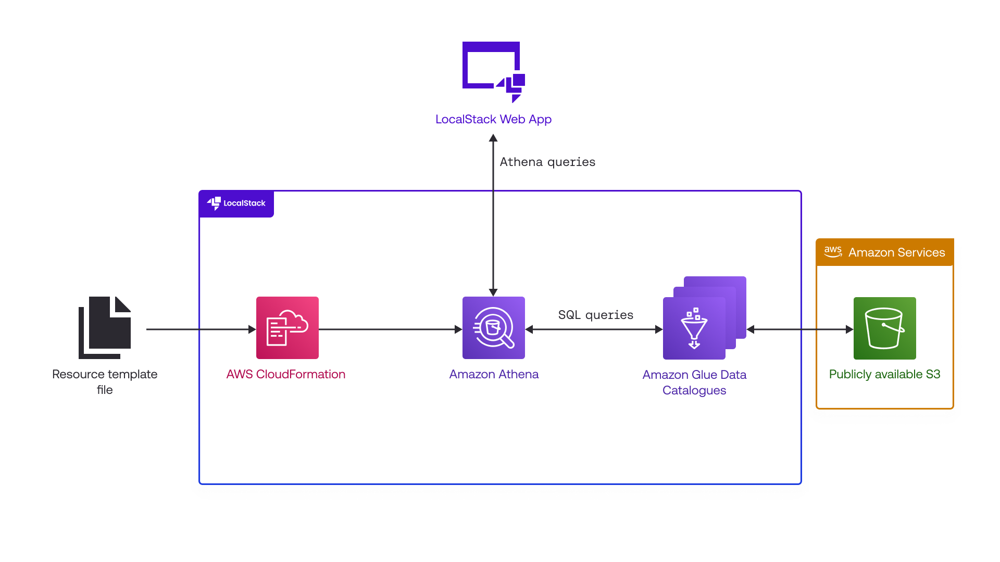

# Query data in S3 Bucket with Amazon Athena, Glue Catalog & CloudFormation

| Key          | Value                                                                             |
| ------------ | --------------------------------------------------------------------------------- |
| Environment  | LocalStack, AWS                                                                   |
| Services     | S3, Athena, Glue, CloudFormation                                                  |
| Integrations | AWS CLI, CloudFormation                                                           |
| Categories   | Big Data, Analytics, Data Lake                                                    |
| Level        | Intermediate                                                                      |
| Use Case     | Resource Browsers, Big Data Testing                                               |
| GitHub       | [Repository link](https://github.com/localstack/sample-query-data-s3-athena-glue) |

## Introduction

This sample demonstrates how to build a comprehensive data analytics pipeline using Amazon Athena, S3, and Glue Catalog to query large datasets stored in a data lake. Starting with raw COVID-19 datasets from the [Registry of Open Data on AWS](https://registry.opendata.aws/), you'll deploy a complete analytics infrastructure that enables running standard SQL queries against structured data in S3 buckets. To test this application sample, we will demonstrate how you use LocalStack to deploy the infrastructure on your developer machine and validate big data workflows locally. The demo showcases LocalStack's [Resource Browser capabilities](https://docs.localstack.cloud/aws/capabilities/web-app/resource-browser/) for exploring Athena databases and running interactive SQL queries without the cost and complexity of AWS infrastructure.

> [!NOTE]
> - Initial service startup may take several minutes for dependency installation
> - Query performance is optimized for development testing, not production-scale analytics
> - Dataset size is limited to sample COVID-19 data for demonstration purposes

## Architecture

The following diagram shows the architecture that this sample application builds and deploys:



- [S3 Buckets](https://docs.localstack.cloud/aws/services/s3/) for storing COVID-19 datasets and Athena query results
- [Glue Data Catalog](https://docs.localstack.cloud/aws/services/glue/) for metadata management and schema definitions
- [Athena](https://docs.localstack.cloud/aws/services/athena/) serverless query service for interactive SQL analytics
- [CloudFormation](https://docs.localstack.cloud/aws/services/cloudformation/) for Infrastructure as Code deployment
- Multiple data sources: hospital beds, vaccine distribution, and aggregated case data

## Prerequisites

- [`localstack` CLI](https://docs.localstack.cloud/getting-started/installation/#localstack-cli) with a [`LOCALSTACK_AUTH_TOKEN`](https://docs.localstack.cloud/getting-started/auth-token/)
- [AWS CLI](https://docs.localstack.cloud/user-guide/integrations/aws-cli/) with the [`awslocal` wrapper](https://docs.localstack.cloud/user-guide/integrations/aws-cli/#localstack-aws-cli-awslocal)
- [`make`](https://www.gnu.org/software/make/) (**optional**, but recommended for running the sample application)

> [!NOTE]
> This sample uses Athena & Glue Data Catalog which requires various dependencies to be lazily downloaded and installed at runtime, which increases the processing time on the first load. To mitigate this, you can pull the Big Data Mono container image with the default dependencies pre-installed.
> ```shell
> docker pull localstack/localstack-pro:latest-bigdata
> ```
> Start the container with `IMAGE_NAME=localstack/localstack-pro:latest-bigdata` configuration variable to use the pre-installed dependencies.

## Installation

To run the sample application, you need to install the required dependencies.

First, clone the repository:

```shell
git clone https://github.com/localstack/sample-query-data-s3-athena-glue.git
```

Then, navigate to the project directory:

```shell
cd sample-query-data-s3-athena-glue
```

No additional installation steps are required as the sample uses CloudFormation templates and AWS CLI commands.

## Deployment

Start LocalStack Pro with the `LOCALSTACK_AUTH_TOKEN` pre-configured:

```shell
localstack auth set-token <LOCALSTACK_AUTH_TOKEN>
IMAGE_NAME=localstack/localstack-pro:latest-bigdata localstack start
```

To deploy the sample application infrastructure, run the following command:

```shell
make deploy
```

Alternatively, you can deploy manually step-by-step.

### Create S3 bucket and upload data

```shell
awslocal s3 mb s3://covid19-lake
awslocal s3 cp cloudformation-templates/CovidLakeStack.template.json s3://covid19-lake/cfn/CovidLakeStack.template.json
awslocal s3 sync ./covid19-lake-data/ s3://covid19-lake/
```

### Deploy CloudFormation stack

```shell
awslocal cloudformation create-stack --stack-name covid-lake-stack --template-url https://covid19-lake.s3.us-east-2.amazonaws.com/cfn/CovidLakeStack.template.json
```

### Verify deployment

```shell
awslocal cloudformation describe-stacks --stack-name covid-lake-stack | grep StackStatus
```

Wait for `CREATE_COMPLETE` status before proceeding.

## Testing

After deployment, you can test the analytics pipeline using the LocalStack Web Application's Athena SQL viewer at [https://app.localstack.cloud/inst/default/resources/athena/sql](https://app.localstack.cloud/inst/default/resources/athena/sql).

### Query Examples

Run queries against the `covid-19` database in the Glue Data Catalog:

#### Hospital beds data

```sql
SELECT * FROM covid_19.hospital_beds LIMIT 10
```


#### Aggregated COVID data by states

```sql
SELECT * FROM covid_19.enigma_aggregation_us_states
```


#### Moderna vaccine distribution

```sql
SELECT * FROM covid_19.cdc_moderna_vaccine_distribution
```


#### Integration tests

You can also run automated integration tests:

```shell
make test
```

## Use Cases

### Resource Browsers

In this sample, LocalStack's Resource Browser provides a web-based interface for interacting with Athena and Glue services without requiring additional tooling or AWS console access.

The [Resource Browser](https://app.localstack.cloud/inst/default/resources/athena/sql) allows you to:

- Browse Glue Data Catalog databases and tables through the left navigation panel
- Execute SQL queries directly in the browser with syntax highlighting and result formatting
- View query execution history and rerun previous queries for iterative development

This approach eliminates the need to install and configure local SQL clients or connect to remote AWS services during development.

### Big Data Testing

This sample includes patterns for testing big data workflows locally before deploying to production environments. LocalStack enables comprehensive validation of big data components without cloud infrastructure costs.

Key testing scenarios include:

- Schema and Metadata Testing:
    - Validate Glue Data Catalog table definitions and column mappings
    - Test partitioning strategies and data formats (JSON, CSV, Parquet)
    - Verify CloudFormation template creates correct database and table structures
- Query Testing:
    - Execute representative SQL queries against sample datasets
    - Validate query execution plans and optimization strategies
    - Test different table join patterns and aggregation logic
- Integration Testing:
    - End-to-end validation from S3 data ingestion through Athena query execution
    - Verify S3 bucket policies and access patterns work correctly

LocalStack's isolated environment ensures tests don't interfere with production data while providing realistic AWS service behavior for comprehensive validation.

## Troubleshooting

| Issue | Resolution |
|-------|-----------|
| Big Data services taking long to start | Use the pre-built `localstack-pro:latest-bigdata` Docker image to avoid dependency installation |
| CloudFormation stack creation fails | Verify S3 bucket exists and template is uploaded before creating stack |
| Athena queries return no results | Check Glue Data Catalog tables are created and S3 data is properly uploaded |
| Resource Browser not loading | Ensure LocalStack is running and the stack has been created successfully |
| Query execution timeouts | Reduce query complexity for development testing and review the LocalStack logs for any errors |

## Summary

This sample application demonstrates how to build, deploy, and test a complete big data analytics pipeline using AWS services and LocalStack. It showcases the following patterns:

- Deploying scalable data lake architectures using S3, Athena, and Glue Data Catalog with CloudFormation
- Running interactive SQL analytics against large datasets stored in S3 buckets
- Using LocalStack's Resource Browser for intuitive data exploration and query development
- Implementing comprehensive testing strategies for big data workflows in local environments
- Leveraging AWS parity to ensure consistent behavior between development and production environments
- Managing metadata and schema evolution through Glue Data Catalog integration

The application provides a foundation for understanding enterprise data analytics patterns and building cost-effective development workflows for AWS big data services.

## Learn More

- [LocalStack Athena Documentation](https://docs.localstack.cloud/aws/services/athena/)
- [LocalStack Glue Data Catalog](https://docs.localstack.cloud/aws/services/glue/)
- [LocalStack Resource Browser](https://docs.localstack.cloud/user-guide/web-application/resource-browser/)
- [AWS Data Lake Architecture](https://aws.amazon.com/big-data/datalakes-and-analytics/)
- [COVID-19 Data Lake Blog Post](https://aws.amazon.com/blogs/big-data/a-public-data-lake-for-analysis-of-covid-19-data/)
